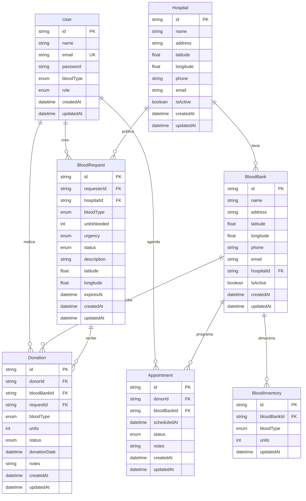

# BloodConnect - Modelo de Base de Datos

**Versión:** 2.0  
**Fecha:** Junio 2026  
**ORM:** Prisma  
**Base de datos:** PostgreSQL

---

## 1. Diagrama Entidad-Relación



---

## 2. Descripción de Modelos

### 2.1 User (Usuarios)

Almacena todos los usuarios del sistema: donantes, receptores, personal médico y administradores.

| Campo | Tipo | Descripción |
|-------|------|-------------|
| `id` | UUID | Identificador único |
| `name` | String | Nombre completo |
| `email` | String | Email único para login |
| `password` | String | Contraseña hasheada con bcrypt |
| `bloodType` | Enum | Tipo de sangre (A+, A-, B+, B-, AB+, AB-, O+, O-) |
| `role` | Enum | Rol del usuario (DONOR, RECIPIENT, MEDICAL, ADMIN) |
| `createdAt` | DateTime | Fecha de registro |
| `updatedAt` | DateTime | Última actualización |

**Relaciones:**
- Crea muchas `BloodRequest` (1:N)
- Realiza muchas `Donation` (1:N)
- Agenda muchas `Appointment` (1:N)

### 2.2 Hospital

Instituciones médicas que pueden crear solicitudes de sangre y tener bancos de sangre asociados.

| Campo | Tipo | Descripción |
|-------|------|-------------|
| `id` | UUID | Identificador único |
| `name` | String | Nombre del hospital |
| `address` | String | Dirección física |
| `latitude` | Float | Coordenada GPS |
| `longitude` | Float | Coordenada GPS |
| `phone` | String? | Teléfono de contacto |
| `email` | String? | Email de contacto |
| `isActive` | Boolean | Si está operativo |
| `createdAt` | DateTime | Fecha de creación |
| `updatedAt` | DateTime | Última actualización |

**Relaciones:**
- Tiene muchos `BloodBank` (1:N)
- Tiene muchas `BloodRequest` (1:N)

### 2.3 BloodBank (Bancos de Sangre)

Centros de almacenamiento de sangre. Pueden ser independientes o pertenecer a un hospital.

| Campo | Tipo | Descripción |
|-------|------|-------------|
| `id` | UUID | Identificador único |
| `name` | String | Nombre del banco |
| `address` | String | Dirección física |
| `latitude` | Float | Coordenada GPS |
| `longitude` | Float | Coordenada GPS |
| `phone` | String? | Teléfono |
| `email` | String? | Email |
| `hospitalId` | UUID? | Hospital al que pertenece (nullable) |
| `isActive` | Boolean | Si está operativo |
| `createdAt` | DateTime | Fecha de creación |
| `updatedAt` | DateTime | Última actualización |

**Relaciones:**
- Pertenece a un `Hospital` (N:1, opcional)
- Tiene muchos `BloodInventory` (1:N)
- Tiene muchas `Donation` (1:N)
- Tiene muchos `Appointment` (1:N)

### 2.4 BloodInventory (Inventario de Sangre)

Inventario de unidades de sangre por tipo en cada banco. Es una tabla de "stock".

| Campo | Tipo | Descripción |
|-------|------|-------------|
| `id` | UUID | Identificador único |
| `bloodBankId` | UUID | Banco de sangre |
| `bloodType` | Enum | Tipo de sangre |
| `units` | Int | Unidades disponibles |
| `updatedAt` | DateTime | Última actualización |

**Relaciones:**
- Pertenece a un `BloodBank` (N:1)

**Restricción única:** Un banco solo puede tener un registro por tipo de sangre `(bloodBankId, bloodType)`.

### 2.5 BloodRequest (Solicitudes de Sangre)

Solicitudes de sangre creadas por hospitales o usuarios receptores.

| Campo | Tipo | Descripción |
|-------|------|-------------|
| `id` | UUID | Identificador único |
| `requesterId` | UUID | Usuario que solicita |
| `hospitalId` | UUID? | Hospital asociado (si aplica) |
| `bloodType` | Enum | Tipo de sangre necesario |
| `unitsNeeded` | Int | Cantidad de unidades |
| `urgency` | Enum | `LOW`, `MEDIUM`, `HIGH`, `CRITICAL` |
| `status` | Enum | `OPEN`, `IN_PROGRESS`, `FULFILLED`, `CANCELLED`, `EXPIRED` |
| `description` | String? | Notas adicionales |
| `latitude` | Float | Ubicación de la solicitud |
| `longitude` | Float | Ubicación de la solicitud |
| `expiresAt` | DateTime? | Fecha de expiración |
| `createdAt` | DateTime | Fecha de creación |
| `updatedAt` | DateTime | Última actualización |

**Relaciones:**
- Pertenece a un `User` (requester) (N:1)
- Pertenece a un `Hospital` (N:1, opcional)
- Tiene muchas `Donation` (1:N)

### 2.6 Donation (Donaciones)

Registro de cada donación de sangre realizada.

| Campo | Tipo | Descripción |
|-------|------|-------------|
| `id` | UUID | Identificador único |
| `donorId` | UUID | Usuario donante |
| `bloodBankId` | UUID? | Banco donde se realizó |
| `requestId` | UUID? | Solicitud a la que responde (nullable) |
| `bloodType` | Enum | Tipo de sangre donado |
| `units` | Int | Unidades donadas |
| `status` | Enum | `SCHEDULED`, `COMPLETED`, `CANCELLED`, `VERIFIED` |
| `donationDate` | DateTime? | Fecha real de la donación |
| `notes` | String? | Notas del personal médico |
| `createdAt` | DateTime | Fecha de creación |
| `updatedAt` | DateTime | Última actualización |

**Relaciones:**
- Pertenece a un `User` (donor) (N:1)
- Pertenece a un `BloodBank` (N:1, opcional)
- Pertenece a un `BloodRequest` (N:1, opcional)

### 2.7 Appointment (Citas)

Citas programadas para donar sangre en un banco específico.

| Campo | Tipo | Descripción |
|-------|------|-------------|
| `id` | UUID | Identificador único |
| `donorId` | UUID | Usuario donante |
| `bloodBankId` | UUID | Banco de sangre |
| `scheduledAt` | DateTime | Fecha y hora de la cita |
| `status` | Enum | `PENDING`, `CONFIRMED`, `COMPLETED`, `CANCELLED`, `NO_SHOW` |
| `notes` | String? | Notas adicionales |
| `createdAt` | DateTime | Fecha de creación |
| `updatedAt` | DateTime | Última actualización |

**Relaciones:**
- Pertenece a un `User` (donor) (N:1)
- Pertenece a un `BloodBank` (N:1)

---

## 3. Enums

```prisma
enum BloodType {
  A_POSITIVE
  A_NEGATIVE
  B_POSITIVE
  B_NEGATIVE
  AB_POSITIVE
  AB_NEGATIVE
  O_POSITIVE
  O_NEGATIVE
}

enum UserRole {
  DONOR
  RECIPIENT
  MEDICAL
  ADMIN
}

enum Urgency {
  LOW
  MEDIUM
  HIGH
  CRITICAL
}

enum RequestStatus {
  OPEN
  IN_PROGRESS
  FULFILLED
  CANCELLED
  EXPIRED
}

enum DonationStatus {
  SCHEDULED
  COMPLETED
  CANCELLED
  VERIFIED
}

enum AppointmentStatus {
  PENDING
  CONFIRMED
  COMPLETED
  CANCELLED
  NO_SHOW
}
```

---

## 4. Migraciones

```bash
# Crear migración
npm run db:migrate -- --name add_hospitals_blood_banks_requests_donations_appointments

# Aplicar migraciones en producción
npx prisma migrate deploy

# Resetear base de datos (desarrollo)
npx prisma migrate reset

# Generar cliente de Prisma
npm run db:generate

# Ver base de datos
npm run db:studio

# Ejecutar seed
npm run db:seed
```

---

## 5. Seed Data

El archivo `prisma/seed.ts` crea datos iniciales:

- **5 hospitales** en CDMX (Hospital General de México, Hospital ABC, Hospital Ángeles del Pedregal, Instituto Nacional de Cardiología, Hospital Médica Sur)
- **6 bancos de sangre** (5 asociados a hospitales + 1 independiente)
- **48 registros de inventario** (8 tipos de sangre × 6 bancos, con unidades aleatorias entre 5 y 54)

---

## 6. Consideraciones de Privacidad

| Dato | Sensibilidad | Protección |
|------|--------------|------------|
| Contraseña | Alta | Hash con bcrypt |
| Email | Media | No expuesto en API pública |
| Tipo de sangre | Baja | Visible en perfil público |
| Ubicación GPS | Media | Solo se usa para calcular distancia |
